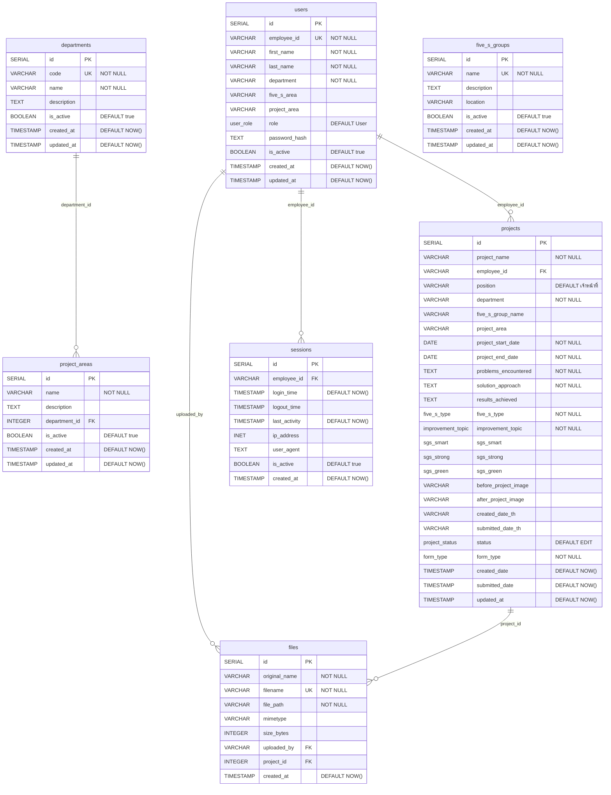

# Kaizen Web Application - Database ER Diagram

This Mermaid ER diagram represents the complete database structure for the Kaizen Web Application.

## Database Schema Overview

### Core Tables
- **users**: Employee/user account information with role-based access
- **projects**: Main Kaizen project data (forms: genba, suggestion, best_kaizen)
- **departments**: Department master data
- **project_areas**: Project area classifications linked to departments
- **five_s_groups**: Five S group master data for workplace organization
- **sessions**: User session management for security tracking
- **files**: File upload tracking with project associations

### Key Relationships
1. **users → projects**: One user can create multiple projects
2. **users → sessions**: One user can have multiple active sessions
3. **users → files**: One user can upload multiple files
4. **departments → project_areas**: One department contains multiple project areas
5. **projects → files**: One project can have multiple associated files

### Enum Types
The schema uses several PostgreSQL ENUM types for data validation:
- **user_role**: Admin, Manager, Supervisor, User
- **five_s_type**: ส1, ส2, ส3, ส4, ส5
- **improvement_topic**: Safety, Env, Quality, Cost, Delivery
- **sgs_smart**: People, Factory
- **sgs_strong**: Energy_3R, Workplace
- **sgs_green**: Teamwork, Branding
- **form_type**: genba, suggestion, best_kaizen
- **project_status**: EDIT, WAITING, APPROVED, REJECTED

### Security Features
- Row Level Security (RLS) enabled on sensitive tables
- JWT-based authentication policies
- Role-based access control for data visibility and modification
- Audit trails with created_at/updated_at timestamps
- Automatic timestamp triggers for data tracking