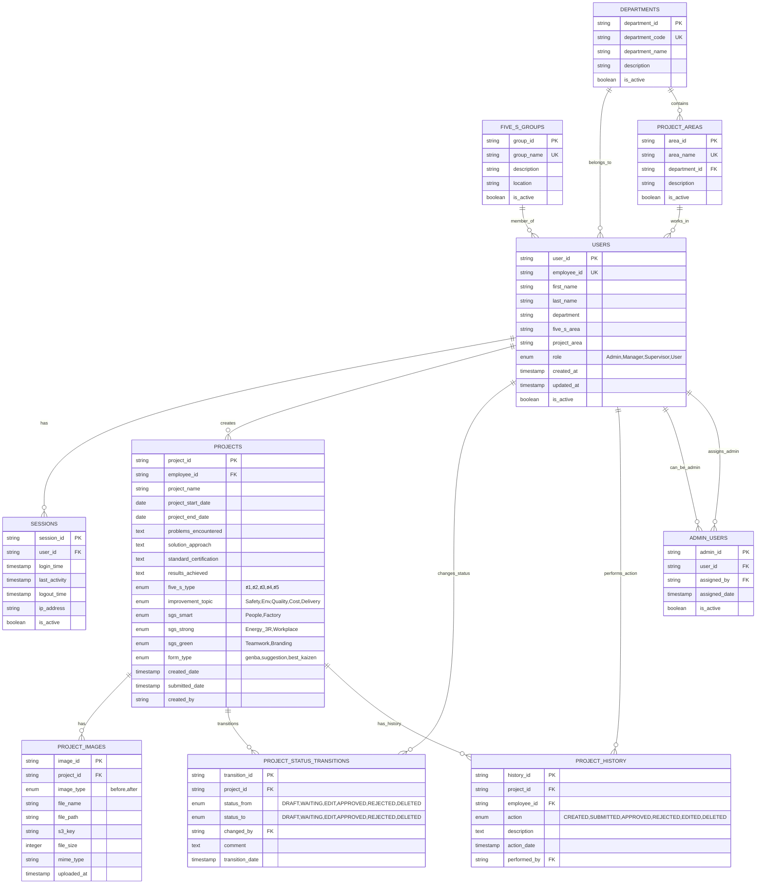

# ER Diagram - Kaizen Web Application

## Overview
This document describes the Entity-Relationship Diagram for the Kaizen Web Application database structure. The system manages employee data, project forms (Genba and Suggestion), workflow approvals, and administrative functions.

## Entity Relationship Diagram



## Key Design Principles

### 1. User Management
- **USERS**: Core employee data with role-based access control
- **SESSIONS**: Session management for login/logout tracking
- **ADMIN_USERS**: Separate table for admin role assignment

### 2. Project Management
- **PROJECTS**: Main project data from Genba and Suggestion forms
- **PROJECT_IMAGES**: Separate table for image storage with S3 integration
- **PROJECT_STATUS_TRANSITIONS**: Complete audit trail of status changes
- **PROJECT_HISTORY**: Historical record of all project activities

### 3. Master Data
- **DEPARTMENTS**: Department reference data
- **FIVE_S_GROUPS**: 5S group reference data
- **PROJECT_AREAS**: Project area reference data

### 4. Form Type Differences
- **Genba Form**: Includes both `before` and `after` images
- **Suggestion Form**: Includes only `before` images
- **Best Kaizen**: Special category for approved excellent projects

### 5. Status Workflow
```
DRAFT → WAITING → APPROVED
  ↓       ↓         ↓
DELETED  EDIT → WAITING → APPROVED/REJECTED
```

## Security Considerations

1. **Role-Based Access Control**: Admin, Manager, Supervisor, User roles
2. **Audit Trail**: Complete tracking of all changes and actions
3. **Session Management**: Secure session handling with timeout
4. **File Security**: S3 integration with proper access controls

## Scalability Features

1. **UUID Primary Keys**: Ensures uniqueness across distributed systems
2. **Separate Image Storage**: Optimized for file handling
3. **History Tables**: Maintains performance while keeping complete audit trail
4. **Master Data Tables**: Normalized structure for easy maintenance

## Next Steps

1. Implement database schema in MySQL/PostgreSQL
2. Set up AWS S3 bucket for image storage
3. Create database indexes for performance optimization
4. Implement backup and recovery procedures